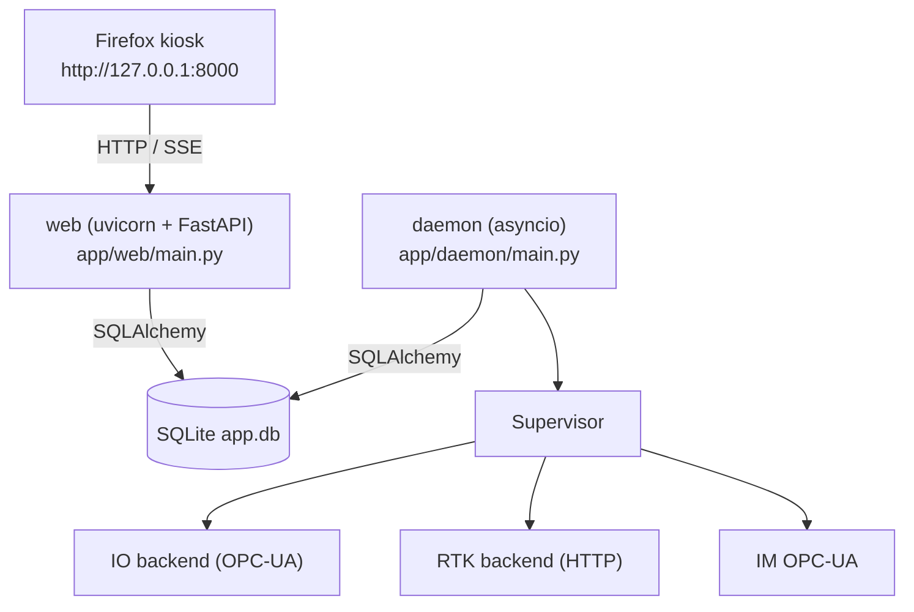

# ABCD

Локальная система управления производственным участком: веб-интерфейс рабочего места оператора, фоновый демон управления оборудованием и связка с РТК, постаматами, микрометром и OPC-UA/ПЛК.

Проект рассчитан на запуск **на одной Linux-машине** (Ubuntu) без systemd, через bash-лаунчер `run_stack_linux.sh`. Пользовательский интерфейс открывается в Firefox в режиме kiosk.

---

## Возможности

- **Web-интерфейс рабочего места** (`uvicorn app.web.main:app`, FastAPI) — рабочее место оператора, журнал событий, экспорт, авторизация, администрирование.
- **Фоновый демон** (`app.daemon.main`) — опрос оборудования, обработка команд, супервизор производственного цикла, публикация сообщений оператору.
- **Интеграция с РТК** — через HTTP (`RTK_BACKEND=http`) или mock (`RTK_BACKEND=mock`).
- **Интеграция с постаматами и ПЛК** — OPC-UA (`asyncua`), два независимых эндпоинта: основной ПЛК (SZC_ES) и микрометр (IM).
- **Микрометр (ИМ)** — загрузка программы, калибровка/проверка, измерения, работа с журналом, вакуум, контроль связи со стабилизацией после reconnect.
- **Печать документов** — протоколы и этикетки (папка `printed_documents/`).
- **Живые события** — SSE-поток `/api/events`.
- **Firefox в kiosk-режиме** — автоматический запуск рабочего места после старта web.
- **Ярлык на рабочем столе** — `АЛКУ.desktop` для запуска/безопасного перезапуска стека.
- **SQLite** — единая БД `app.db` (с WAL/SHM), миграции через `Base.metadata.create_all`.

---

## Архитектура
- **Планировщик** — `app/daemon/scheduler.py` — `asyncio`-бесконечный цикл, который запускает `supervisor.py` для каждого `product` и `event` в очереди.




Слои:

| Каталог | Назначение |
|---|---|
| `app/web/` | FastAPI-приложение: `main.py`, `api.py`, `auth.py`, `export.py` |
| `app/daemon/` | Фоновый демон и оборудование: supervisor, IO, OPC-UA, РТК, микрометр, принтер, стек-лампа |
| `app/infra/` | SQLAlchemy: `db.py`, `models.py`, `repo.py` |
| `app/common/` | Общие утилиты: `enums.py`, `schemas.py`, `timeutils.py`, `product_rules.py`, `runtime_paths.py` |
| `scripts/` | Вспомогательные скрипты: kiosk, запуск сессии |
| `runtime/` | Runtime-состояние демона: lock-файл, снапшоты температуры |
| `printed_documents/` | Сохранённые печатные формы (протоколы, этикетки) |

---

## Требования

- **ОС:** Ubuntu (тестировалось на Ubuntu с графической сессией X11/Wayland).
- **Python:** 3.11+ (в `__pycache__` встречаются 3.11, 3.12, 3.14).
- **Firefox** (Snap-сборка Ubuntu подходит).
- **Доступ к оборудованию:**
  - OPC-UA серверы (основной ПЛК и микрометр) в сети.
  - РТК-сервис по HTTP.
  - Принтер (CUPS-имя, например `HP_LaserJet_M406_B14F90`).
  - Последовательное устройство для QR-сканера (`/dev/ttyACM0`, группа `dialout`).
- **Пакеты системы:** `setfacl` (ACL), `sudo` (для первичной настройки группы).

---

## Установка

```bash
git clone <repo-url> ABCD
cd ABCD

python3 -m venv .venv
source .venv/bin/activate
pip install -r requirements.txt
